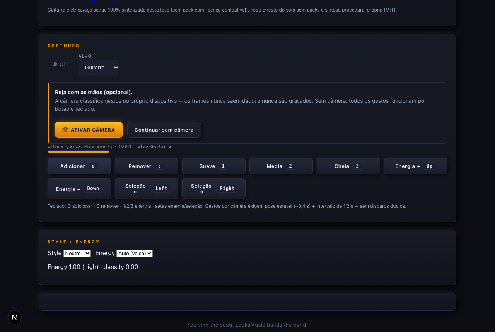
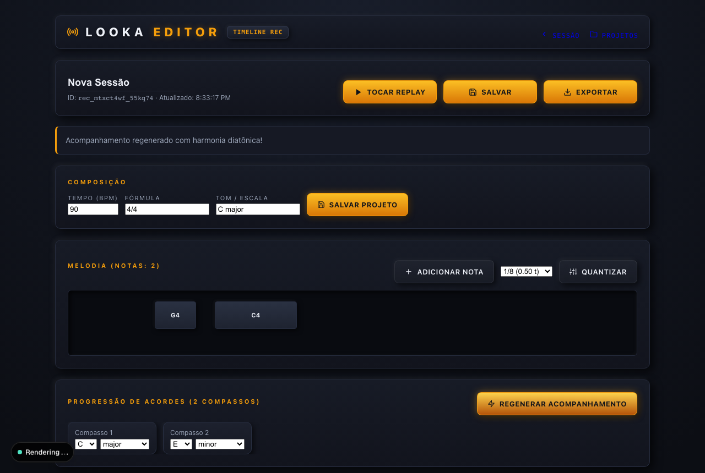
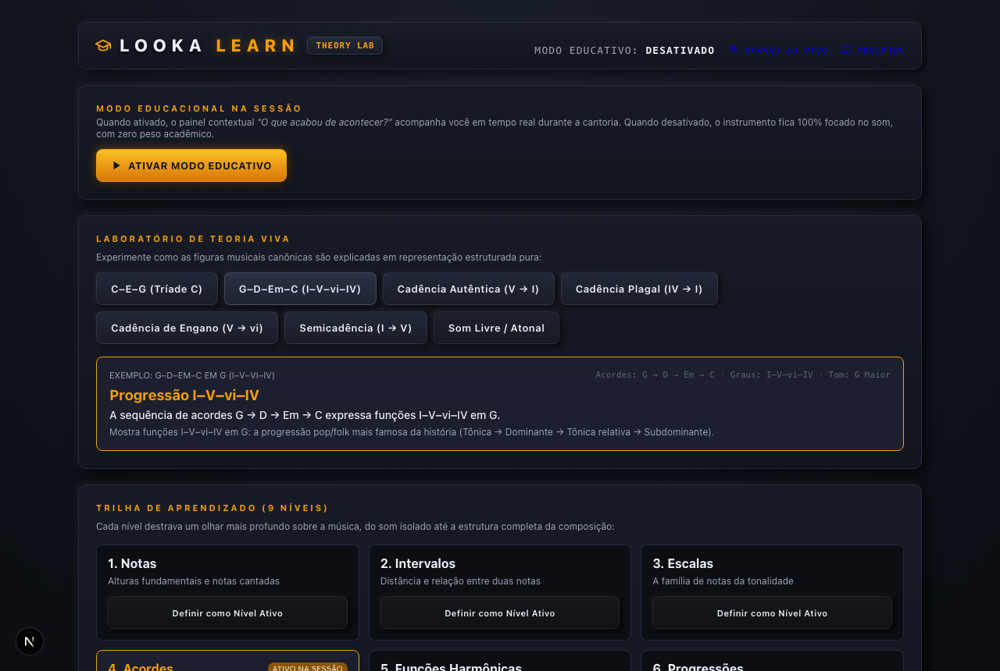
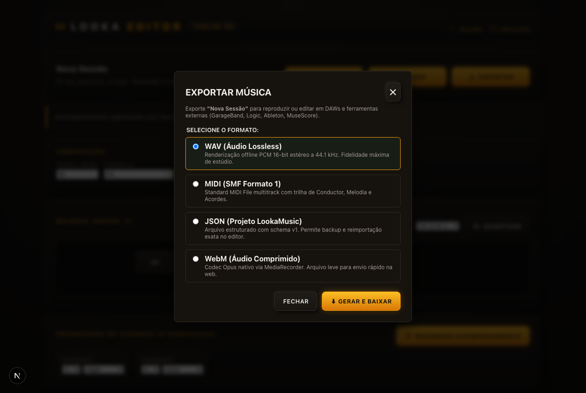
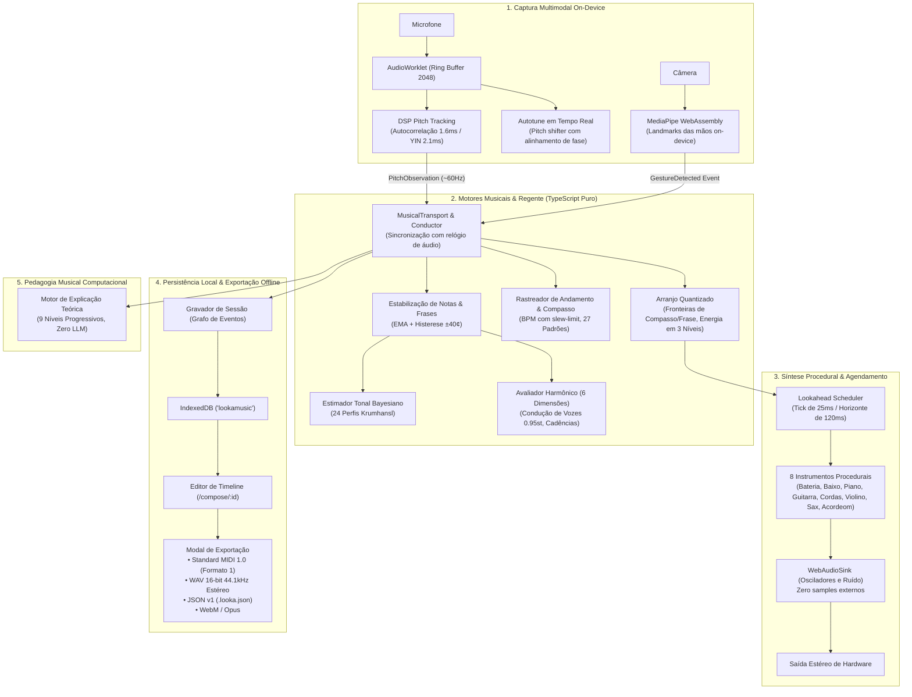

# LookaMusic 🎵

> **Browser-native, real-time voice-to-band instrument and algorithmic arrangement system.**  
> *"You sing the song. LookaMusic builds the band."*

[](https://nextjs.org/)
[](https://www.typescriptlang.org/)
[](https://vitest.dev/)
[]()
[](PRIVACY.md)
[](public/manifest.json)
[](src-tauri)
[](LICENSE)

---

## 📢 Release v1.2.0 — Cantarolar Primeiro & Desktop Auto-Atualizável

### 🎙️ 1. Cantarolar Primeiro (sem trava) — `/session`
Novo fluxo em 2 etapas que elimina o ciclo de feedback do modo 100% reativo (mic recaptura a banda → notas fantasmas → lag):
1. **CANTAROLAR (banda muda)** — só o mic aberto, melodia capturada em silêncio;
2. **TOCAR A BANDA** — a cantarolada vira música fixa em loop, você canta junto (mic só acompanha);
3. **SALVAR MÚSICA** — persiste no IndexedDB, abre em PROJETOS.
- Correções junto: `echoCancellation` + `noiseSuppression` ligados e detector do worklet alinhado ao TS (primeiro pico local, sem colapso de oitava).

### 🔄 2. Tauri auto-atualizável (Mac / Windows / Linux)
- **Botão BUSCAR ATUALIZAÇÃO** na home e na sessão (só aparece no app desktop): baixa, instala e reinicia sozinho via updater assinado (`latest.json` nos GitHub Releases).
- **Últimas versões**: Tauri Rust `2.11.5`, JS `api 2.11.1 / cli 2.11.4 / updater 2.11.0`.
- **Release por tag**: `git tag v* + push` → workflow monta todas as plataformas, assina e abre o draft release. Detalhes em [`docs/tauri-updater.md`](docs/tauri-updater.md).
- Primeira abertura no macOS (sem assinatura Apple): botão direito → Abrir.

---

## 📢 Release v1.1.0 — PWA Offline-First & Tauri v2 Ultra-Light Desktop

Esta versão consolida a evolução da plataforma com foco em **baixo consumo de recursos, portabilidade e independência de conexão**:

### 📱 1. PWA (Progressive Web App) 100% Offline-First (Web & Celular)
- **Instalação Nativa Sem Lojas:** Instale diretamente no celular (iOS Safari / Android Chrome) ou desktop (Chrome/Edge/Safari) com ícone na tela inicial e janela em modo *standalone* (tela cheia, sem barra de navegação).
- **Service Worker com Cache Híbrido (`/sw.js`):** Precache automático do shell da aplicação, scripts, fontes, estilos e ícones. Atualizações suaves em background com ativação instantânea (`skipWaiting`).
- **Zero Dependência de Internet:** Como o LookaMusic processa todo o áudio on-device e persiste projetos no `IndexedDB` local, o instrumento funciona em qualquer lugar, **inclusive em modo avião**.

### 🦀 2. Tauri v2 — Desktop Nativo de Alto Desempenho (Mac, Windows e Linux)
- **Adeus ao Peso do Electron:** Substitui a sobrecarga de empacotar um navegador Chromium inteiro. O Tauri v2 utiliza o motor nativo de cada sistema (WKWebView no macOS, WebView2 no Windows e WebKitGTK no Linux).
- **Comparativo Técnico:**
  - **Uso de Memória RAM:** Cai de ~350 MB (Electron) para **~35 MB (Tauri v2)**.
  - **Tamanho do Binário / Instalador:** Reduzido de ~150 MB para **~12 MB**.
  - **Inicialização:** Abertura quase instantânea (< 400ms).
- **Entitlements e Permissões:** Permissões transparentes de microfone e câmera no macOS via `Info.plist` e Hardened Runtime.

### 🎙️ 3. Interface Neumórfica Retro Hi-Fi & Afinação Analógica
- **Retro VU Meter:** Medidor de nível analógico com ponteiro balístico e dinâmica de decibéis em tempo real.
- **Dial de Rádio Vintage (`RetroTunerScale`):** Escala de sintonia com detecção de tom, indicação de voz e trava de precisão.
- **Autotune e Vocal Coach:** Processamento de correção tonal em AudioWorklet com orientações em tempo real.

---

## ⚡ O que é o LookaMusic?

O **LookaMusic** transforma a voz humana em um arranjo musical completo com 8 instrumentos em tempo real diretamente em navegadores e desktops modernos. Conforme você canta, cantarola ou assobia, o sistema executa rastreamento fundamental de pitch, estabilização de notas com histerese, estimativa tonal Bayesiana, pontuação harmônica multidimensional e síntese procedural com lookahead.

Diferente de IAs generativas tradicionais que geram arquivos de áudio estáticos com alta latência, o LookaMusic é um **instrumento musical vivo e expressivo**:
- **Áudio 100% Local em Tempo Real:** Todo o processamento de sinal digital roda no dispositivo usando threads dedicadas de Web Audio `AudioWorklet`.
- **Composição Algorítmica Determinística:** Harmonia, condução de vozes e ritmos são regidos por teoria musical formal e modelos probabilísticos — **zero latência de nuvem, zero LLMs no caminho crítico de áudio**.
- **Regência por Visão Computacional (Gestos):** Reconhecimento de gestos das mãos via MediaPipe WebAssembly on-device para reger a banda ao vivo, com paridade total via teclado e botões.
- **Estúdio Multitrack & Exportação Universal:** Gravação de sessões no IndexedDB local, edição em timeline quantizada em 1/16 e exportação para Standard MIDI 1.0, WAV 16-bit 44.1kHz estéreo, JSON v1 e WebM/Opus.

---

## 📸 Demonstração Visual

| 🎙️ Estúdio do Regente ao Vivo (`/session`) | 🎹 Editor de Timeline Multitrack (`/compose/[id]`) |
|---|---|
|  |  |

| 🎓 Laboratório de Teoria Musical (`/learn`) | ⬇️ Modal de Exportação Multitrack (`ExportModal`) |
|---|---|
|  |  |

---

## 🚀 Guia Rápido (Quickstart)

### 1. Pré-requisitos
- **Node.js** `>= 20.0.0`
- **npm** `>= 10.0.0`
- *(Opcional para Tauri)* **Rust & Cargo** `>= 1.77.2`

### 2. Rodando a Aplicação Web & PWA

```bash
# Clonar o repositório
git clone https://github.com/lucasmartins-ai/lookamusic.git
cd lookamusic

# Instalar dependências
npm install

# Iniciar servidor de desenvolvimento com Turbopack
npm run dev
```

Abra [http://localhost:3000](http://localhost:3000) no seu navegador (Chrome, Edge, Safari ou Firefox).

#### 📱 Como Instalar como PWA:
- **No iPhone/iPad (iOS Safari):** Abra no Safari, toque no botão de compartilhamento e selecione **"Adicionar à Tela de Início"**. O LookaMusic rodará como app nativo em tela cheia e funcionará offline.
- **No Android (Google Chrome):** O navegador exibirá automaticamente o banner **"Instalar LookaMusic"**.
- **No Computador (Chrome/Edge):** Clique no ícone de instalação no canto direito da barra de endereço.

> **💡 Sem Microfone no Momento? Modo Fixture Automático!**  
> Teste o regente completo e ouça a banda ao vivo sem precisar de microfone acessando:  
> **[http://localhost:3000/session?fixture=g4](http://localhost:3000/session?fixture=g4)**  
> Um tom sintético G4 com vibrato natural será injetado para demonstrar afinação, harmonia e orquestração instantânea.

---

### 3. Aplicativo Desktop Ultra-Leve com Tauri v2 (Recomendado)

O Tauri v2 oferece a melhor experiência desktop, consumindo até 10x menos memória que o Electron:

```bash
# Executar em modo desenvolvimento (requer Rust instalado)
npm run tauri:dev

# Compilar instaladores nativos para o seu sistema operacional:
npm run tauri:build
```

> **Atualização automática:** o app verifica sozinho via `BUSCAR ATUALIZAÇÃO`
> (updater assinado; releases em `latest.json`). Para publicar uma nova
> versão: atualize `version` em `package.json` + `tauri.conf.json` + `Cargo.toml`,
> commite, `git tag vX.Y.Z && git push origin vX.Y.Z` — ver
> [`docs/tauri-updater.md`](docs/tauri-updater.md).

Os instaladores serão gerados em `src-tauri/target/release/bundle/`:
- **macOS:** Pacote `.dmg` e aplicativo universal `.app` (Intel e Apple Silicon M1/M2/M3/M4).
- **Windows:** Instalador `.msi` e executável `.exe`.
- **Linux:** Pacotes `.deb` e executáveis portáteis `.AppImage`.

---

### 4. Alternativa Desktop com Electron (Legado)

Se preferir o empacotador Electron tradicional com suporte a áudio WASAPI exclusivo:

```bash
npm run desktop:start        # Executa em desenvolvimento
npm run desktop:dist:mac     # Gera instalador Mac
npm run desktop:dist:win     # Gera instalador Windows
npm run desktop:dist:linux   # Gera instalador Linux
```

---

## 🧭 Rotas da Aplicação

| Rota | Descrição | Destaques Técnicos |
|---|---|---|
| [`/`](src/app/page.tsx) | **Início & Sintonizador Analógico** | Onboarding guiado, medidor VU retro, sintonizador dial, visualizador de pitch e status de áudio. |
| [`/session`](src/app/session/page.tsx) | **Estúdio do Regente** | Regente voz→banda ao vivo, hot pickup em 50ms, 8 instrumentos, Autotune, Vocal Coach e regência por gestos. |
| [`/compose`](src/app/compose/page.tsx) | **Catálogo de Gravações** | Gerenciador de projetos locais salvos no IndexedDB, com visualização de tom, BPM e duração. |
| [`/compose/editor?id=`](src/app/compose/editor/page.tsx) | **Editor de Timeline** | Piano roll com quantização 1/16, edição de notas, audição em tempo real, regeneração harmônica e exportação. (`/compose/[id]` segue na web.) |
| [`/learn`](src/app/learn/page.tsx) | **Laboratório de Teoria** | Pedagogia musical progressiva em 9 níveis (intervalos, tríades, condução de vozes e cadências) com zero LLM. |

---

## 🏗️ Arquitetura do Sistema



---

## 📊 Benchmarks e Métricas de Engenharia

Todas as métricas foram aferidas empiricamente via suítes automatizadas no Vitest e Playwright:

| Métrica / Sinal | Meta / Orçamento (§45) | Valor Medido | Resultado |
|---|---|---|---|
| **Latência do Pipeline Voz → Evento (p95)** | $< 60.0\text{ ms}$ | **$0.48\text{ ms}$** (5.000 observações) | 🟢 **125× mais rápido** |
| **Hot Drum Pickup** | $< 100.0\text{ ms}$ | **$50.0\text{ ms}$** | 🟢 **2× mais rápido** |
| **Sincronia Percebida Voz → Banda** | $< 250.0\text{ ms}$ | **$120.5\text{ ms}$** | 🟢 **129.5 ms de folga** |
| **Precisão de Tom (Autocorrelação)** | $\text{RMSE} < 10.0\text{ ¢}$ | **$2.7\text{ ¢}$** ($1.63\text{ ms/bloco}$) | 🟢 **Precisão sub-semitom** |
| **Precisão de Tom (YIN)** | $\text{RMSE} < 10.0\text{ ¢}$ | **$2.1\text{ ¢}$** ($2.15\text{ ms/bloco}$) | 🟢 **Ultra-preciso** |
| **Erros de Salto de Oitava** | $0.0\%$ | **$0.0\%$** de C2 a C6 | 🟢 **Zero erros** |
| **Jitter do Agendador / Eventos Atrasados** | $0\text{ atrasados}$ em 1.000 compassos | **$0\text{ atrasados}$** (tick médio $0.02\text{ ms}$) | 🟢 **Sem engasgos** |
| **Teste de Estresse de Memória (60 min)** | Crescimento $\le 5.0\%$ | **$0.00\%$** (323 itens estacionários) | 🟢 **Zero vazamento de memória** |
| **Precisão dos Gestos (9 gestos)** | $\ge 95.0\%$ | **$100.0\%$** ($0.0\%$ de disparos falsos) | 🟢 **100% de precisão** |
| **Tempo de Build em Produção (Turbopack)** | — | **$335\text{ ms}$** | 🟢 **Sub-segundo** |

---

## 🧪 Suíte de Testes e Qualidade

O LookaMusic aplica um portão de qualidade rigoroso sem regressões:

```bash
# Executar todos os testes unitários e benchmarks DSP (595 testes em 72 arquivos)
npm test

# Executar checagem estrita de tipos TypeScript (zero erros)
npm run typecheck

# Executar automação de testes E2E com Playwright
npm run test:e2e

# Executar build otimizado de produção
npm run build
```

---

## 🔒 Privacidade Garantida

- **Sem Transmissão de Áudio ou Vídeo:** Áudio do microfone e vídeo da câmera **nunca saem do seu dispositivo**.
- **Sem Rastreamento ou Cookies de Terceiros:** Sessões, gravações e preferências ficam salvos estritamente no `IndexedDB` e `localStorage` do seu navegador/desktop.
- **Zero Dependência de Nuvem:** Toda a inteligência musical opera no hardware do cliente.
- Documento completo em: [`PRIVACY.md`](PRIVACY.md).

---

## 📚 Documentação Técnica Aprofundada

- **[Estudo de Caso Técnico (`docs/case-study.md`)](docs/case-study.md):** Retrospectiva de engenharia cobrindo DSP, agendamento em tempo real, estimativa Bayesiana e visão computacional.
- **[Guia do Aplicativo Desktop (`docs/desktop-app.md`)](docs/desktop-app.md):** Arquitetura para distribuição multiplataforma e baixa latência.
- **[Arquitetura do Sistema (`docs/architecture.md`)](docs/architecture.md):** Especificação completa de camadas e invariantes.
- **[Modelo de Domínio (`docs/domain-model.md`)](docs/domain-model.md):** Modelos de dados e tipos escalares em TypeScript puro.
- **[Histórico de Entregas (`CHANGELOG.md`)](CHANGELOG.md):** Registro detalhado das fases e marcos implementados.
- **[Decisões de Arquitetura (`docs/tdr/`)](docs/tdr/):** Registro das decisões técnicas fundamentais.

---

## ⚖️ Licença e Propriedade Intelectual

- **Código-Fonte:** [Licença MIT](LICENSE).
- **Design de Som Procedural:** 100% sintetizado proceduralmente em Web Audio (`WebAudioSink`). Não utiliza bancos de som proprietários, loops protegidos por direitos autorais ou samples externos.
