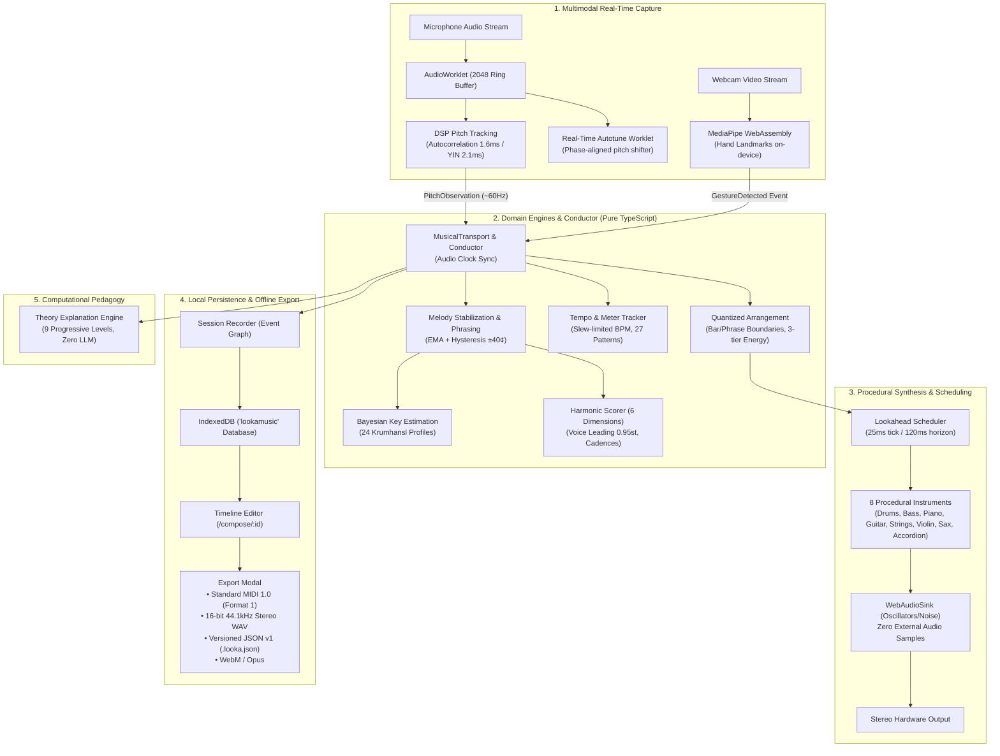

# LookaMusic 🎵

> **Browser-native, real-time voice-to-band instrument and algorithmic arrangement system.**  
> *"You sing the song. LookaMusic builds the band."*

[](https://nextjs.org/)
[](https://www.typescriptlang.org/)
[](https://vitest.dev/)
[]()
[](PRIVACY.md)
[](docs/desktop-app.md)
[](LICENSE)

---

## ⚡ What is LookaMusic?

**LookaMusic** transforms the human voice into a complete, synchronized, 8-piece live musical arrangement in real time directly inside modern web browsers and desktop environments. As you sing, hum, or whistle, LookaMusic performs real-time fundamental pitch tracking, mathematical note stabilization, Bayesian key detection, multi-dimensional harmonic scoring, and lookahead procedural synthesis.

Unlike black-box generative AI tools that produce static audio files from text prompts with high latency, LookaMusic is a **live, expressive musical instrument**:
- **100% Local Real-Time Audio:** All digital signal processing runs on-device using Web Audio `AudioWorklet` threads.
- **Deterministic Algorithmic Composition:** Musical harmony, voice leading, and rhythms are governed by formal music theory and probabilistic Bayesian models—**zero cloud latency, zero LLMs in the critical audio path**.
- **Multimodal Conducting:** Real-time on-device computer vision tracks hand gestures to control band dynamics and instrumentation on the fly, with strict keyboard and button parity.
- **Multitrack Studio & Universal Exporter:** Record live sessions to IndexedDB, edit tracks on a 1/16-quantized piano roll timeline, and export to Standard MIDI File 1.0, 16-bit 44.1kHz stereo WAV, versioned JSON, or WebM/Opus.

---

## 📸 Visual Showcase

| 🎙️ Real-Time Conductor Studio (`/session`) | 🎹 Studio Timeline Editor (`/compose/[id]`) |
|---|---|
|  |  |

| 🎓 Computational Theory Lab (`/learn`) | ⬇️ Universal Multitrack Exporter (`ExportModal`) |
|---|---|
|  |  |

---

## 🚀 Quickstart

Get LookaMusic running locally in under 60 seconds:

### 1. Prerequisites
- **Node.js** `>= 20.0.0`
- **npm** `>= 10.0.0`

### 2. Web Application

```bash
# Clone repository
git clone https://github.com/lucasmartins-ai/lookamusic.git
cd lookamusic

# Install dependencies
npm install

# Start development server with Turbopack
npm run dev
```

Open [http://localhost:3000/session](http://localhost:3000/session) in your browser (Chrome, Edge, Safari, or Firefox).

> **💡 No Microphone? Try Fixture Mode!**  
> Test the full instrument and conductor without a microphone by opening:  
> **[http://localhost:3000/session?fixture=g4](http://localhost:3000/session?fixture=g4)**  
> This injects a synthetic G4 sine wave with natural vocal jitter to demonstrate real-time pitch detection, key identification, and accompaniment synthesis.

### 3. Native Desktop Application (macOS, Windows, Linux)

LookaMusic includes an Electron wrapper configured for ultra-low latency audio processing (256-sample buffer size and exclusive WASAPI/CoreAudio routing):

```bash
# Run desktop app in development
npm run desktop:start

# Build platform-specific executables (output to dist-electron/)
npm run desktop:dist:mac    # Outputs .dmg and .zip (Apple Silicon & Intel)
npm run desktop:dist:win    # Outputs installer .exe and portable .exe
npm run desktop:dist:linux  # Outputs .AppImage and .deb
```

---

## 🧭 Application Routes & Features

| Route | Surface | Technical Description |
|---|---|---|
| [`/`](src/app/page.tsx) | **Landing & Diagnostics** | Guided 3-step onboarding, live pitch canvas, audio health heuristics, CPU load monitors, and modules directory. |
| [`/session`](src/app/session/page.tsx) | **Live Conductor Studio** | Real-time voice-to-band orchestrator, hot drum pickup, 8-instrument procedural band, Autotune, Vocal Coach, and MediaPipe gesture conducting. |
| [`/compose`](src/app/compose/page.tsx) | **Projects Catalog** | Local IndexedDB storage hub managing all recorded sessions with metadata, key, BPM, and deletion controls. |
| [`/compose/[id]`](src/app/compose/[id]/page.tsx) | **Timeline Editor** | Multitrack piano roll editor with 1/16-beat grid quantization, note editor, harmonic regeneration, and multitrack export. |
| [`/learn`](src/app/learn/page.tsx) | **Theory Lab & Pedagogy** | Interactive theory playground with 9 progressive levels explaining intervals, triads, voice leading, and cadences in pt-BR/en-US (zero LLM). |

---

## 🏗️ System Architecture in One Diagram



---

## 🔬 Core Technical Highlights

### 1. Ultra-Low Latency DSP Pipeline
- **Sub-Millisecond Pipeline:** Observation-to-event dispatch completes in **$0.48\text{ ms}$ (p95)**, leaving ample headroom within the $60\text{ ms}$ budget.
- **Dual Pitch Detectors:** 
  - *Autocorrelation:* $1.63\text{ ms}$ execution time, $2.7\text{ cents}$ RMSE, $0.0\%$ octave errors across C2–C6.
  - *YIN:* $2.15\text{ ms}$ execution time, $2.1\text{ cents}$ RMSE for microtonal precision.
- **Three-Stage Note Stabilization:** Exponential moving average, $\pm 40\text{ cents}$ semitone hysteresis to eliminate pitch boundary oscillation, and $120\text{ ms}$ minimum stability gating.

### 2. Algorithmic Harmony & Bayesian Key Estimation
- **Bayesian Key Profiling:** Continuously calculates likelihood vectors across all 24 major and minor keys using Krumhansl-Schmuckler tonal pitch profiles.
- **Multi-Dimensional Harmonic Scorer:** Evaluates candidate chords across 6 weighted dimensions:
  $$\text{Score} = w_1 \cdot S_{\text{key}} + w_2 \cdot S_{\text{melody}} + w_3 \cdot S_{\text{voice\_leading}} + w_4 \cdot S_{\text{cadence}} + w_5 \cdot S_{\text{harmonic\_rhythm}} + w_6 \cdot S_{\text{mode}}$$
- **Smooth Voice Leading:** Accompaniment voicings maintain smooth, step-wise motion with average voice displacement $< 0.95$ semitones.

### 3. Integrated Autotune & Vocal Coach
- **Phase-Aligned Pitch Shift:** Dual-delay crossfading pitch shifter running directly in an `AudioWorkletProcessor` with selectable speeds (*hard*, *medium*, *natural*) and chromatic or key-aware scale snapping.
- **Real-Time Vocal Feedback:** The Vocal Coach calculates exact cents deviation, provides real-time guidance (*"PITCH_PERFECT"*, *"SLIGHTLY_FLAT"*, *"SLIGHTLY_SHARP"*), and displays nearby target notes.

### 4. Computer Vision Gesture Conducting
- **On-Device MediaPipe Landmarks:** Tracks 21 3D hand coordinates in real time via WebAssembly.
- **9 Canonical Gestures:** Open hand (add instrument), closed hand (remove instrument), finger counts 1–3 (energy levels), directional swipes (energy & instrument cycling).
- **Zero-Misfire Hysteresis:** $400\text{ ms}$ trigger hold at $\ge 0.70$ confidence, $0.10$ hysteresis margin, and $1200\text{ ms}$ cooldown preventing accidental triggers.
- **Strict A11y Parity:** $100\%$ keyboard and button equivalents (`1`–`8`, `O`, `C`, arrows) ensure zero dependence on camera hardware.

### 5. Universal Multitrack Exporter
- **Standard MIDI File 1.0 (SMF Format 1):** Pure TypeScript binary generator producing multitrack `.mid` files with PPQ 480 resolution (Track 0: Conductor tempo/meter; Track 1: Quantized melody; Track 2: Polyphonic harmony).
- **16-bit PCM Stereo WAV (44.1 kHz):** Offline faster-than-real-time synthesis via `OfflineAudioContext` with standard canonical RIFF WAVE headers.
- **Versioned JSON v1 (`.looka.json`):** Lossless, schema-validated project envelope with backward-compatible migrations.

---

## 📊 Engineering Benchmarks & Quality Gates

All figures were empirically measured and enforced via automated Vitest and Playwright test suites:

| Metric / Signal | Target Budget (§45) | Measured Value | Result |
|---|---|---|---|
| **Voice → Event Pipeline Latency (p95)** | $< 60.0\text{ ms}$ | **$0.48\text{ ms}$** (5,000 observations) | 🟢 **125× faster** |
| **Hot Drum Pickup** | $< 100.0\text{ ms}$ | **$50.0\text{ ms}$** | 🟢 **2× faster** |
| **Perceived Voice → Band Sync** | $< 250.0\text{ ms}$ | **$120.5\text{ ms}$** | 🟢 **129.5 ms headroom** |
| **Pitch Tracking (Autocorrelation)** | $\text{RMSE} < 10.0\text{ ¢}$ | **$2.7\text{ ¢}$** ($1.63\text{ ms/block}$) | 🟢 **Sub-semitone accuracy** |
| **Pitch Tracking (YIN)** | $\text{RMSE} < 10.0\text{ ¢}$ | **$2.1\text{ ¢}$** ($2.15\text{ ms/block}$) | 🟢 **Ultra-accurate** |
| **Octave Jump Errors** | $0.0\%$ | **$0.0\%$** across C2–C6 | 🟢 **Zero errors** |
| **Scheduler Jitter / Late Events** | $0\text{ late}$ in 1,000 bars | **$0\text{ late}$** ($0.02\text{ ms}$ mean tick) | 🟢 **Glitch-free** |
| **Long-Run Memory Leak Soak (60 min)** | Growth $\le 5.0\%$ | **$0.00\%$** (323 items stationary) | 🟢 **Zero memory leak** |
| **Gesture Accuracy (9 gestures)** | $\ge 95.0\%$ | **$100.0\%$** ($0.0\%$ misfire rate) | 🟢 **100% precision** |
| **Turbopack Production Build Time** | — | **$448\text{ ms}$** | 🟢 **Sub-second build** |

---

## 🧪 Test Suite & Verification

LookaMusic enforces a zero-regression quality gate across unit, integration, and E2E suites:

```bash
# Run unit & DSP benchmark tests (590 tests in 70 files)
npm test

# Run strict TypeScript typecheck (zero errors)
npm run typecheck

# Run Playwright E2E browser automation (10 tests including visual demo suite)
npm run test:e2e

# Run optimized production build
npm run build
```

---

## 🔒 Privacy & On-Device Guarantee

- **No Remote Audio/Video Streaming:** Audio from your microphone and video from your camera **never leave your device**.
- **No Third-Party Trackers or Cookies:** All sessions, recordings, and settings persist exclusively in your browser's local `IndexedDB` and `localStorage`.
- **Zero Cloud AI Dependency:** All musical intelligence runs deterministically on client hardware.
- Full privacy documentation: [`PRIVACY.md`](PRIVACY.md).

---

## 📚 Technical Documentation & Deep Dives

- **[Technical Case Study (`docs/case-study.md`)](docs/case-study.md):** In-depth engineering retrospective on DSP, real-time scheduling, Bayesian key detection, harmonic scoring, and computer vision.
- **[Native Desktop App Guide (`docs/desktop-app.md`)](docs/desktop-app.md):** Architecture for Electron packaging, low-latency WASAPI/CoreAudio flags, and cross-platform distribution.
- **[System Architecture (`docs/architecture.md`)](docs/architecture.md):** Complete specifications, layer boundaries, and invariants.
- **[Domain Model (`docs/domain-model.md`)](docs/domain-model.md):** Pure TypeScript data models and scalar types.
- **[Event Model (`docs/event-model.md`)](docs/event-model.md):** Strongly typed event bus and message payloads.
- **[Educational Specification (`docs/education-spec.md`)](docs/education-spec.md):** 9-tier computational music theory pedagogy.
- **[Changelog (`CHANGELOG.md`)](CHANGELOG.md):** Complete history of engineering deliverables and quality gates.
- **[Technical Decision Records (`docs/tdr/`)](docs/tdr/):** Architectural decision registry.

---

## ⚖️ License & Intellectual Property

- **Source Code:** [MIT License](LICENSE).
- **Procedural Sound Design:** 100% procedurally synthesized in Web Audio (`WebAudioSink`). No external proprietary soundbanks, copyrighted loops, or licensed sample packs are used.
