# Dependency Graph (§61.4) — Normative Module Architecture (Phase 15 Final)

```mermaid
flowchart TD
    subgraph UI ["Camada de Apresentação (React & Next.js App Router)"]
        PAGES["app/\n(/, /session, /compose, /compose/:id, /learn)"]
        COMP["components/\n(TimelineEditor, ExportModal, GesturePanel, LearnPanel, BandPanel, StatusCard)"]
        PAGES --> COMP
    end

    subgraph APP ["Camada de Aplicação & Orquestração"]
        COND["features/conductor/\n(MusicalTransport, ConductorState, Conductor, LatencyTracker, Degradation)"]
        GEST["features/gestures/\n(GestureRecognizer, SwipeDetector, CameraSession, GestureArrangementBridge)"]
        REC["features/recording/\n(SessionRecorder, ReplayEngine, IndexedDB Storage, CompositionEditor)"]
        EXP["features/export/\n(SMF Format 1 MIDI, 16-bit PCM WAV, Versioned JSON v1, WebM/Opus)"]
        PEDAGOGY["features/learn/\n(Theory Explanation Engine, Progressive Levels 1–9)"]
        SCHED["features/instruments/scheduler.ts\n(Lookahead Scheduler: 25ms tick / 120ms horizon)"]
    end

    subgraph DOMAIN_ENGINES ["Camada de Domínio & Motores Musicais (TypeScript Puro)"]
        MEL["features/music/melody/\n(Smoothing, Hysteresis, NoteStabilizer, PhraseTracker)"]
        THEO["features/music/theory/\n(PitchClass, Intervals, Scales, KeyEstimator Krumhansl, Chords, Functions)"]
        HAR["features/music/harmony/\n(Scorer 6-dim, Diatonic Candidates, Voice Leading, Cadence)"]
        RHY["features/music/rhythm/\n(Slew-limited Tempo, MeterTracker 4/4-3/4-6/8, 27 Patterns, EnergyNormalizer)"]
        ARR["features/music/arrangement/\n(ArrangementEngine, Quantized Bar/Phrase Transitions, Presets)"]
        INST_ENGINES["features/instruments/\n(8 Procedural Timbre Planners: Drums GM, Bass, Piano, Guitar, Strings, Violin, Sax, Accordion)"]
    end

    subgraph INFRA ["Camada de Infraestrutura & I/O Web"]
        DSP["features/pitch/\n(Autocorrelation & YIN Pitch Detectors)"]
        AUDIO_WORKLET["features/audio/ & public/worklets/\n(AudioWorkletNode DSP, MicSession)"]
        VISION["MediaPipe WebAssembly & WebGPU\n(HandLandmarker via dynamic import)"]
        SYNTH["features/instruments/audio-sink.ts\n(WebAudioSink & OfflineAudioContext)"]
        STORAGE["IndexedDB (compositions store)\n+ Memory Fallback"]
    end

    subgraph DOMAIN_CORE ["Núcleo do Domínio (TypeScript Puro - Zero I/O)"]
        CORE_TYPES["domain/types.ts\n(NoteEvent, Chord, MusicalState, InstrumentId, GestureKind)"]
        EVENTS["domain/events.ts\n(Typed Domain Event Graph)"]
        CONFIG["lib/config.ts\n(Centralized Configuration — Zero Magic Numbers)"]
        EVENT_BUS["lib/event-bus.ts\n(Decoupled Pub/Sub Event Bus)"]
    end

    %% UI connections
    PAGES --> COND
    PAGES --> REC
    PAGES --> EXP
    PAGES --> PEDAGOGY
    COMP --> GEST

    %% Conductor & App orchestration
    COND --> MEL
    COND --> HAR
    COND --> RHY
    COND --> ARR
    COND --> SCHED
    GEST -->|"GestureDetected Event"| COND
    REC --> CORE_TYPES
    EXP --> SYNTH
    EXP --> CORE_TYPES
    PEDAGOGY --> THEO

    %% Domain engine dependencies
    MEL --> THEO
    HAR --> THEO
    SCHED --> INST_ENGINES
    INST_ENGINES --> SYNTH

    %% Infrastructure feeds
    AUDIO_WORKLET --> DSP
    DSP -->|"PitchObservation (~30-60Hz)"| COND
    VISION -->|"Hand Landmarks"| GEST
    REC --> STORAGE

    %% Shared core
    DOMAIN_ENGINES --> DOMAIN_CORE
    APP --> DOMAIN_CORE
    INFRA --> DOMAIN_CORE

    %% Throttling & Boundaries
    UI -.->|"Throttled UI Updates (12 Hz meters, events)"| APP
    DSP -.->|"Compact postMessage only (no raw samples to UI)"| APP

    classDef pure fill:#243324,stroke:#4caf50,stroke-width:1px,color:#e0e0e0;
    classDef app fill:#222a3a,stroke:#4a90e2,stroke-width:1px,color:#e0e0e0;
    classDef ui fill:#332822,stroke:#f5a623,stroke-width:1px,color:#e0e0e0;
    classDef infra fill:#2d2433,stroke:#9b51e0,stroke-width:1px,color:#e0e0e0;

    class DOMAIN_ENGINES,DOMAIN_CORE pure;
    class APP app;
    class UI ui;
    class INFRA infra;
```

## Architectural Invariants (§53 & Phase 15 Acceptance)

1. **Critical Audio Path Isolation**: 100% local, runs in `AudioWorklet` and procedural `WebAudioSink`. Zero cloud API calls or LLM roundtrips.
2. **Strict Domain Purity**: `src/domain` and `src/features/music/theory` are pure TypeScript — zero imports from React, Web Audio API, or DOM APIs.
3. **Event-Driven Orchestration**: Gestures communicate exclusively via `GestureDetected` domain events received by the `Conductor`. Computer vision code never imports or manipulates audio sinks or instruments.
4. **Configuration Centralization**: Zero magic constants outside `src/lib/config.ts`.
5. **Separation of Concerns**: React components only render structured state; all scheduling, music theory, and synthesis live in application/domain layers.
